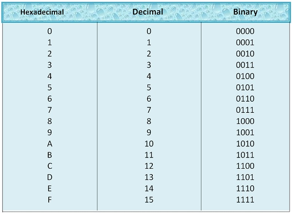
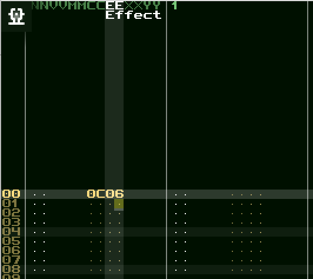
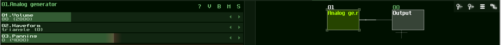
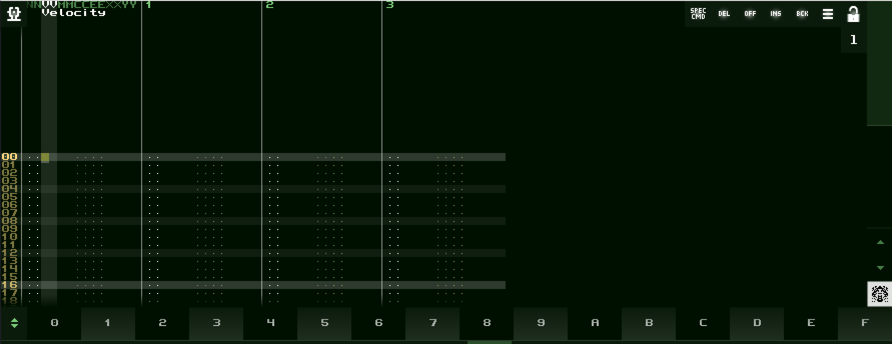
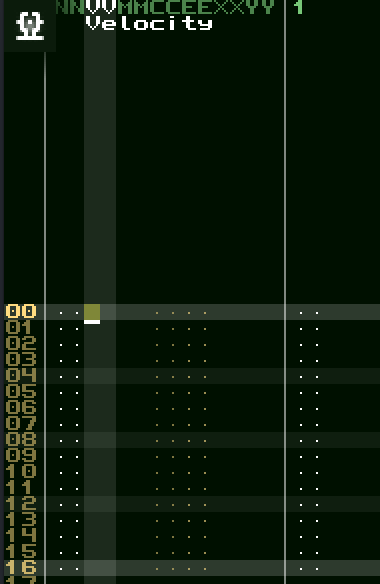
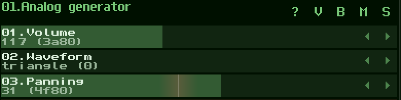

_Just as a horse must have endurance and no defects, so it is with weapons.
Horses should walk strongly, and swords and companion swords should cut strongly.
Spears and halberds must stand up to heavy use: bows and guns must be sturdy.
Weapons should be hardy rather than decorative. - Miyamoto Musashi_

## Understanding Hexadecimal

## I. Hexadecimal

SunVox, like other tracker software, uses hexadecimal in many parts of the application to represent numerical values.

To understand Hexadecimal, and why it is used, its easiest to start by examining  decimal.

In decimal, or `base 10`, we have these primitives to work with: `0`, `1`, `2`, `3`, `4`, `5`, `6`, `7`, `8`, `9`. To construct a number larger than the biggest primitive in `base 10` we can place however many of these primitives next to eachother to indicate different values which add up to be the final value, the number itself. For example, for the number which is one larger than 9, we put a `0` in the ones place (the `0` in `10`) to indicate that we have _zero_ `1`'s, and a `1` in the tens place (the `1` in `10`) to indicate that we have _one_ `10`. We then add these up to construct our final value, the number itself. In this way of thinking any number as its written could be thought of as a calculation, and _base `10`_ is just a way of defining the multipier of each digit place value at each place of the number (ie. `10`'s, `100`'s, `1000`'s, etc). (Spoiler alert: if you change the base, you completely change the actual value of the number, although the number itself appears to be exactly the same.)

_Base `10`_ is shorthand for saying: _.  When you read a number with multiple digits from right to left, start by multiplying the first number by the first digit place value, which is `1`. For the second digit place value to the left of the first, multiply `10` (the total number of primitives we have to work with) with the first digit place value, then multiply this total by the number at the position. For the third, multiply `10` with the digit place value of the second position,  then multiply this total by the number at the position, etc. Then add up all those totals, which equals the number itself._

For example, the number `283` in decimal/`base 10` could be looked at like
* Multiply `3` by the first digit place value, or `1`, to get 3.
* Then multiply `8` by the second digit place value - which you get by multiplying `10` times the digit place value to the right (which in this case is `1`), so `10`. `8` times `10` is `80`.
* Then multiply the `2` by the third digit place value - which you get by  multiplying `10` times the digit place value to the right (which in this case is `10`), so `100`. `2` times `100` is `200`.

Hexadecimal (or hex) just means _base 16_ instead of _base 10_, which is decimal. This chart shows hex numbers and their decimal equivalents:

In Hexadecimal, or _base `16`_, everything is the same as decimal above, but you have more primitives to work with: 0, 1, 2, 3, 4, 5, 6, 7, 8, 9, A, B, C, D, E, F.

once we've counted one beyond `15` (the `15` as in base 15 includes `0` as a number), there are no more single digits that we can use to represent the next number, `10` (Note, this is not `10` as we know it in decimal, this is `10` from the perspective of hex!) Instead, we put a `0` in the ones place (the `0` of `10`) to indicate that we have _zero_ `1`'s, and a `1` in the _fifteens_ place (the `1` of `10`) to indicate that we have _one_ `15`. We add these up to get our final number value.  

Places where Hexadecimal appears in the application include:

---

* __Controller (parameter) values__ in the pattern editor (in this case entering the value `0C` (equivalent to 12 in decimal) in the `Controller` column, and `06` (equivalent to 6 in decimal) in the `Effect` column):

---

* __Module ID's__, viewable above the module in the module window (the right section) as well as before the name of the selected module as shown in the controller window (the left section):

___

* In the __data entry__ row at the bottom of the pattern editor when edit mode is turned on and the cursor is on a column that holds a hexadecimal value (see the tutorials in [5. The Pattern Editor Section](https://github.com/way-of-the-sunvox/Way-of-the-SunVox/blob/master/1--Tutorial/5--The-Pattern-Editor-Section))

---

## II. Decimal

Some areas of the application where decimal is used include:

* __Line numbers in patterns__, where each line numbers represents a 16th note.

---

and controller values in the controller window, where the first value listed is decimal, with hex in parentheses:

0	| 1	| 2	| 3	| 4	| 5	| 6	| 7	| 8	| 9	| A	| B	| C	| D	| E	| F
--- | --- | --- | --- | --- | --- | --- | --- | --- | --- | --- | --- | --- | --- | --- | --- |
0 | 1 | 2 | 3 | 4 | 5 | 6 | 7 | 8 | 9 | 10 | 11 | 12 | 13 | 14 | 15

10 | 11	| 12 | 13 | 14 | 15 | 16 | 17	| 18 | 19	| 1A | 1B	| 1C | 1D	| 1E | 1F
--- | --- | --- | --- | --- | --- | --- | --- | --- | --- | --- | --- | --- | --- | --- | --- |
16 | 17 | 18 | 19 | 20 | 21 | 22 | 23 | 24 | 25 | 26 | 27 | 28 | 29 | 30 | 31

20 | 21	| 22 | 23	| 24 | 25 | 26 | 27	| 28 | 29	| 2A | 2B	| 2C | 2D	| 2E | 2F
--- | --- | --- | --- | --- | --- | --- | --- | --- | --- | --- | --- | --- | --- | --- | --- |
32 | 33 | 34 | 35 | 36 | 37 | 38 | 39 | 40 | 41 | 42 | 43 | 44 | 45 | 46 | 47

30 | 31	| 32 | 33	| 34 | 35 | 36 | 37	| 38 | 39	| 3A | 3B	| 3C | 3D	| 3E | 3F
--- | --- | --- | --- | --- | --- | --- | --- | --- | --- | --- | --- | --- | --- | --- | --- |
48 | 49 | 50 | 51 | 52 | 53 | 54 | 55 | 56 | 57 | 58 | 59 | 60 | 61 | 62 | 63

...

## [Official Documentation](http://www.warmplace.ru/wiki/doku.php?id=sunvox:manual_en)
A few words about hex numbers. Memory locations and software in today's computers use the hexadecimal (hex) number system which comprises sixteen distinct symbols, digits 0 - 9 and letters A, B, C, D, E, F (or a - f) where the letters represent the numbers 10 - 15. For more detail on the hexadecimal system please visit: http://en.wikipedia.org/wiki/Hexadecimal

Examples of hexadecimal numbers and its decimal (dec) equivalents:

00 = 0;
01 = 1;
…
09 = 9;
0A = 10;
0B = 11;
0C = 12;
0D = 13;
0E = 14;
0F = 15;
10 = 16;
11 = 17;
…
FF = 255

## [The Complete Guide to Sunvox](https://sunvox-guide.readthedocs.io/en/latest/beginner/hex-intro.html)
Introduction to hex notation
Hex notation is just another way of writing numbers.

In normal decimal notation (what you’re probably used to) you have:

0	1	2	3	4	5	6	7	8	9
10	11	12	13	14	15	16	17	18	19
20	21	22	23	24	25	26	27	28	…
In hexadecimal (or hex, for short) this becomes:

0	1	2	3	4	5	6	7	8	9
a	b	c	d	e	f	10	11	12	13
14	15	16	17	18	19	1a	1b	1c	…
The way this works is that instead of running from 0 through 9, digits run from 0 through 15. However, since we don’t have digits for 10, 11, 12, 13, 14 or 15, we use letters. So, a means 10, b means 11 and so on.

This change also extends to the positions of digits. In regular decimal notation, if you have two digits the first one counts tens. If you have three digits, the first one counts hundreds, the second counts tens and so on.

For example, if we have the number 14 in decimal, that can also be shown mathematically as:

1×10+4×1=14
In hexadecimal, you don’t need a special position to count tens, because you can simply write “a” and have the same as 10 in decimal. Instead, you have a digit that counts by 16, or 161. The next digit up from that counts by 256, or 162. Next comes the digit that counts by 4096, or 163.

This is why 14 in hexadecimal corresponds to 20 in decimal:

1×16+4×1=20
When we rearrange our hex table above based on what we just learned, it looks like this:
0 | 1 | 2 | 3 | 4 | 5 | 6 | 7 | 8 | 9 | 10 | 11 | 12 | 13 | 14 | 15 | 16
--- | --- | --- | --- | --- | --- | --- | --- | --- | --- | --- | --- | --- | --- | --- | --- |
0	| 1	| 2	| 3	| 4	| 5	| 6	| 7	| 8	| 9	| a	| b	| c	| d	| e	| f
10 | 11	| 12 | 13 | 14 | 15 | 16 | 17	| 18 | 19	| 1a | 1b	| 1c | 1d	| 1e | 1f
20 | 21	| 22 | 23	| 24 | 25 | 26 | 27	| 28 | 29	| 2a | 2b	| 2c | 2d	| 2e | 2f

Why do we use hex notation while tracking?
People use hex notation in tracking software for technical and historic reasons. This differs from many other types of DAW software, which often use decimal.

Electronic computers use the binary system of counting, to indicate on/off or +/-. The only two digits available are 0 and 1, which leads to long numbers like 11001 (which is 25 in decimal). Hexadecimal is a way to show those numbers very concisely, while keeping a mathematical relationship to the number 2.

The first tracking apps from the 1980s ran on computers far slower than today’s, with limited screen space. Today, SunVox aims to support low-resolution screens and slower processors.

Hex gives you two advantages here:

You can show the full range of numbers of a “byte” using two digits (00-ff) instead of three with decimal (0-255).
You can work more directly with what’s in the computer’s memory, which can lead to smaller and more efficient code.
Interestingly, it also happens to fit well with the quarter note rhythms typical of music! After understanding, then practice, it will be familiar and comfortable for you to use.

---

[(Sitemap)](https://github.com/way-of-the-sunvox/Way-of-the-SunVox/blob/master/Sitemap.md)
