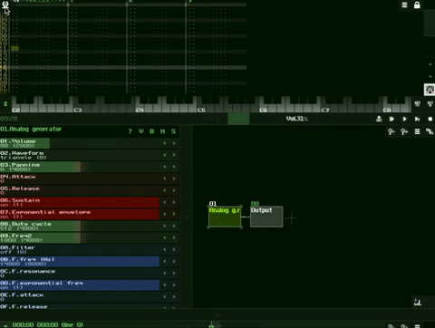

_One of the virtues of the bow is that you can see the arrows in flight and correct
your aim accordingly, whereas gunshot cannot be seen. You must appreciate the
importance of this. - Miyamoto Musashi_

# Saving and Loading Projects as `sunvox` Files

## I. About `sunvox` Files

The `sunvox` file is the root level file which contains the entire SunVox project. `sunvox` files are saved self-contained, meaning all audio referenced by the file is copied and saved into the file itself. This way you never have to worry about opening a session and finding out that audio could not be read because it was moved.

## II. The File Browser

The file browser in SunVox is used to load and save both `sunvox` and `sunsynth` files (for more information about `sunsynth` files see the tutorial [Saving and Loading Modules as sunsynth Files](https://github.com/way-of-the-sunvox/Way-of-the-SunVox/blob/master/2--The-Module-Section/b--Saving-and-Loading-Modules-as-sunsynth-Files))

## III. Saving Projects

How to save a `sunvox` file:

## IV. Loading Projects

How to load a sunvox file:

## V. About Hexadecimal

SunVox uses the Hexadecimal number system in many places in the application. Understanding hexadecimal is not mission critical when starting to learn SunVox, so feel free to go directly to the next tutorial (below), but if you'd like to gain an understanding of what Hexadecimal is and why it is used in SunVox, go to [Understanding Hexadecimal](https://github.com/way-of-the-sunvox/Way-of-the-SunVox/blob/master/II--Reference/4--Understanding-Hexadecimal) in the reference section.

---

_Next Tutorial: [Creating and Connecting Modules](https://github.com/way-of-the-sunvox/Way-of-the-SunVox/tree/master/I--Tutorial/2--The-Module-Section/a--Creating-and-Connecting-Modules)_

[(Sitemap)](https://github.com/way-of-the-sunvox/Way-of-the-SunVox/blob/master/Sitemap.md)
