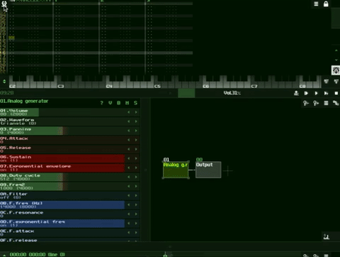

_One of the virtues of the bow is that you can see the arrows in flight and correct
your aim accordingly, whereas gunshot cannot be seen. You must appreciate the
importance of this. - Miyamoto Musashi_

# Loading and Saving Projects

There are two primary file formats used by SunVox.

## I. Saving Projects

The `sunvox` file is the root level file which contains the entire project. `sunvox` files are saved self-contained, meaning all audio referenced by the file is copied and saved into the file itself. This way you never have to worry about opening a session and finding out that audio could not be read because it was moved.

How to save a `sunvox` file:

## II. Loading Projects

---

_Next Tutorial: [Understanding Hexadecimal](../d--Understanding-Hexadecimal)_

[(Sitemap)](https://github.com/way-of-the-sunvox/Way-of-the-SunVox/blob/master/Sitemap.md)
