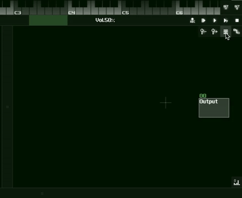

_You should not have a favourite weapon. To become over-familiar with one
weapon is as much a fault as not knowing it sufficiently well. You should not copy others,
but use weapons which you can handle properly. It is bad for commanders and troops to
have likes and dislikes. These are things you must learn thoroughly. - Miyamoto Musashi_

## Creating and Connecting Modules

1. Move the mouse up to the menu icon in the center right window, which is the module window.

2. Select "New" from the menu

3. In the dialog that appears, select whatever sound generating module (anything under the Synths category) you would like to load (in this case an analog generator).

4. Press return to select and create the module.

5. Holding shift, drag from the newly created module to the output module. This will connect them, and introduce a one way signal flow between them. Imagine the line is a cable which can either carry audio or midi information, with the flow of information always heading towards the output module, which connects to the system preference selected for audio output (ie. whether you are using the deafult sound through your laptop speakers or a 3rd party soundcard).

6. Make sure the new module is selected, and click on the keyboard above the module section to hear the module playing. Whatever module is selected in the module window will receive midi note input.

---

_Next Tutorial: [Module Commands](https://github.com/way-of-the-sunvox/Way-of-the-SunVox/tree/master/I--Tutorial/2--The-Module-Section/b--Module-Commands)_

[(Sitemap)](https://github.com/way-of-the-sunvox/Way-of-the-SunVox/blob/master/Sitemap.md)
