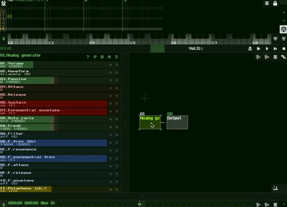

# Saving Modules as SunSynths

## II. The `sunsynth` file

The SunSynth is a saved snapshot of the state of a module, including the state of its controllers (or parameters). You can think of this as similar to a plugin, chain of plugins, or preset in other music making apps, but simpler and more easily defined. One of the coolest things about SunVox is how everything is build up from module primitives native to the app, so the line between "instrument", "plugin", "preset", different UI's, etc as in most music creation environments, is non-existent. SunVox sits at a level of abstraction below a traditional DAW (ie. Ableton, Logic, etc) but above a musical coding environment (ie. MaxMSP, Reaktor, SuperCollider, Pure Data, etc.) This turns out to be ideal for being able to design any sound you want in a really powerful but simple interface, but not get sucked into instrument design/coding concerns, which can easily move in to replace the music making process using lower level environments.

The [MetaModule](https://github.com/way-of-the-sunvox/Way-of-the-SunVox/tree/master/II--Reference/3--Misc-Modules/MetaModule) is a special type of module that significantly adds to the power of SunVox as well as what can be saved as a `sunsynth` file. MetaModules are modules which hold within them entirely separate `sunvox` files from the `sunvox` file that hosts them. This means that the MetaModule can host instruments, effect chain, sequencers, entire projects, and anything else you can dream up that uses the full power of SunVox. The only limit to how many or how deeply these can be nested is CPU. As you can imagine this becomes very meta and very powerful. Each `sunsynth` becomes a resuseable component, with components being nestable. For you programmers out there, this becomes a lot like functional programming. For you non-programmers out there, this is a way to separate concerns and work with a system where you can reuse your work in future sessions quickly and easily.

As with `sunvox` files, `sunsynth` files are also saved completely self contained (ie. if you were to save a sampler or a MetaModule which included a sampler within it, any audio the sampler(s) reference would be copied and kept in the `sunsynth` file itself).

How to save a `sunsynth` file:

