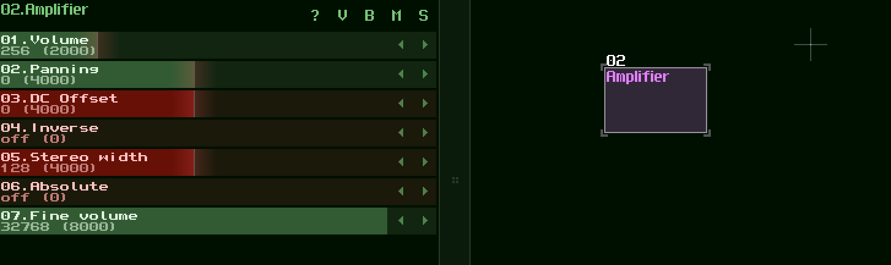

# Amplifier

`1. Volume: affects the volume of whatever passes through the module [0...1024] `

`2. Panning: affects the stereo balance of the signal, panning left when a negative value and right when a positive value [-128...128]`

`3. DC offset: when not 0 offsets the mean amplitude of the waveform to some positive or negative value [-128...128]`

`4. Inverse amplitude: ? [0 - off; 1 - on]`

`5. Width: affects the stereo width of the signal, either collapsing it (reducing the stereo information) or expanding it (increasing it so it sounds wider, but may run into phase issues on stereo systems) [0 - mono; 128 - normal; 256 - extended)`

`6. Absolute: filters the signal to only allow positive values (above the x-axis) of the waveform [0 - off; 1 - on]`

`7. Fine volume: affects fine volume (0 - 32768)`

---

[(Sitemap)](../../../Sitemap.md)
