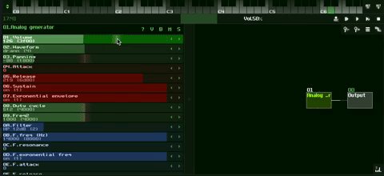

## Tutorial 2: Editing Module Parameters

---

  

  1. Make sure the center left section is visible as in the gif above. If it is not, the center pane has been moved all the way to the left, click and drag to expand
  2. This section is a series of sliders that correspind to the parameters of the module, ie. what you can change to alter the sound of the module. In SunVox these parameters are called Controllers, and this window is the controller pane.
  3. As in the gif above, experiment with changing the paramters and then playing the module with keyboard to hear how your changes altered the sound.
